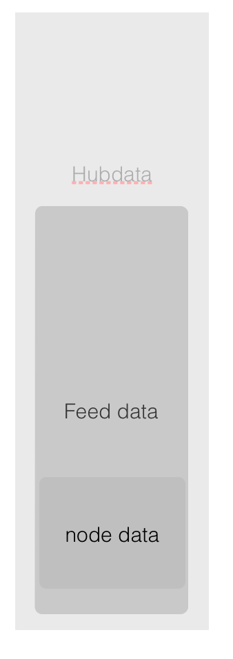

#Summary for WEEK6
##Software Side
Because of waiting the manufacture delivering the PCB, there is no design actually related to hardware expect for the discussions on the final products. In order to build a flexible solution for most of the cases the company is going to work on, the main MCU board keeps simple but complicated with different tiny components. For example, the voltage regulator or the battery charger just in case the application solution needs different output voltage for the sensors. The "LEGO" design is believed to be like a extendable pcb board with four sides or maybe to form as a cube with 6 faces.
The software side didn't go well because of not succeeding on streaming the data like a "server awareness" system. The solution was to simply put a AJAX funciton which does the refresh automatically for every 5 second.
The difficulty was mainly the data model, the design is basically as shown below:

Feed data is generally the data for each different sensor station while the node data is for each different sensors. The idea is that data is stored in nested documents and arrays as JSON format. The users' authetication information would be added on top of this.

